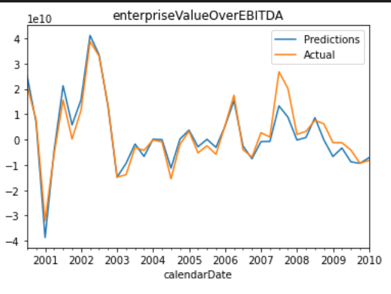
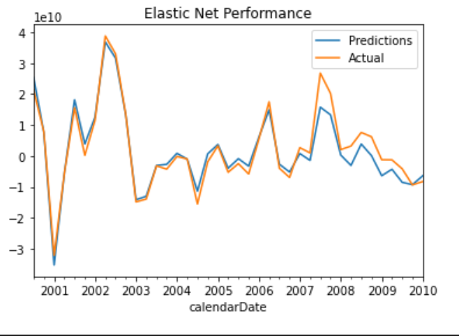
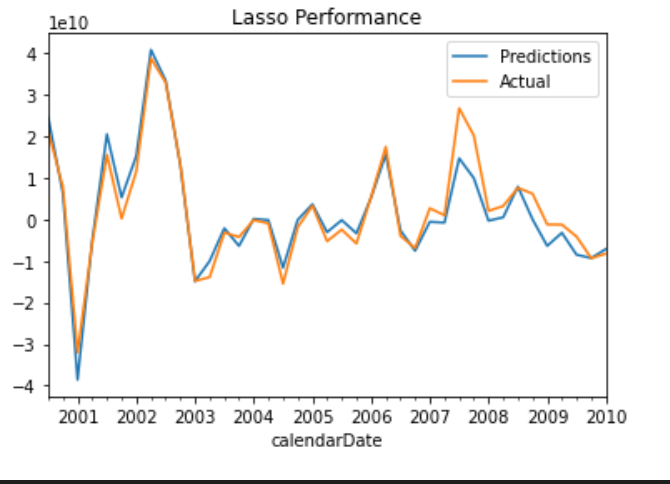

# Building a Resilient Portfolio
## Mala Sharma, Alexander Narvaez-Duckworth, Louis Donofrio, George Mihalopoulos, Matt Szoke

## Proposal / Hypothesis

We have used various machine learning models to study market trends from the early 2000s to 2021. We believe that a multifaceted machine learning approach would allow us to analyze various businesses, commodities, and macroeconomic metrics to discern the investments that may be most resilient to inflation and other periods of economic uncertainty such as during an ongoing global pandemic. We have also focused on company specific financial parameters and distinct outcomes as compared to large-cap closing prices.

### Matt: Inflation Forecasting With FRED Macro-Data and Commodity Pricing

Inflationary numbers (CPI, PPI) are on the rise and there is a great deal of debate as to the duration of this increase.  There are valid arguments linking it to supply chain interruptions, and others arguing it is tied more closely to fiscal policy.  In this research, we used several data sets from FRED going back to 2000.  Our feature set included, Commercial and Industrial Loans, Unemployment, Housing Starts, Personal Savings Rate, 10yr Treasury, and CPI.  The FRED data became our X (independent) data set, while CPI was our Y (dependent).  

An initial analysis of the data using a correlation matrix, revealed a strong relationship with C&I Loans, and a moderate relationship with Unemployment.  

Our models were built with regression methods, so our data needed to be lagged and we also used log returns to reduce the scale in the data.

When examining the model performance, we paid close attention to results with our Test set.  Elastic Net, KNN, and GBR performed the best out of the 11 tested.  We also developed a LSTM which did not perform well.

The second approach to our inflation forecasting method was to repeat the process using commodity pricing as our X data set.  We followed the same methodology and appear to have derived a more meaningful model as a result using GBR. 

Although the model seems to lag the actual numbers in areas and did not catch the 2020 drop, it moves in the correct directions and could be a viable tool for forecasts when tuned further. KEY:  
HG=F  is Copper  
SI=F  is Silver  
GC=F  is Gold  
LBS=F is Lumber  
CL=F  is Crude Oil  
KC=F  is Coffee  
ZC=F  is Corn  
ZW=F  is Wheat  
CPI   is Consumer Price Index  

### Lou: Automated Stock Selection Using KMEANS

Before analyzing the market for inflation we needed to come up with a portfolio of stocks to test it on. We wanted a well diversified portfolio but analyzing hundreds of stocks could be very costly time wise. K-Means clustering took care of this problem by giving us a diversified and streamlined selection of stocks. Using unsupervised learning the model was able to divide stocks with similar characteristics into different groupings that we may not have been able to see on our own.   

-We started out by pulling in all of the closing prices for the components of the S&P500. From there we created a data frame of the average returns and volatility.

-Before running the K-Means model we needed to figure out how many clusters we would want to seperate the data into. We used the elbow curve approach and it showed that 5 clusters was the optimal amount.

-We then ran our K-Means model and got our clustering results
-This graphs shows the 5 different clusters and the stars represent the centroid of each cluster. 

-To ensure a well diversified portfolio we selected one stock from each cluster. We did this by calculating the Sharpe Ratio for each stock and then taking the stock with the highest ratio from each cluster.
-The Sharpe Ratio is a financial metric that measures the performance of a stock vs its risk. The higher the score the better

-By doing this we landed upon 5 well diversified stocks from a dataset of hundreds 

### Alex: Machine Learning on Company Financials
## Home Depot Case Study Part I

We used [Polygon](https://polygon.io/stocks) as the primary source of company financial information. This was a useful API for testing because of its speed and easy access to information through Get requests. We pulled in all of the financial data for our respective companies to the notebook and created a dataframe from it with a datetime index. Then we set a return period for the amount of time we would lag the dataset in order to perform training and testing, and scaled/preprocessed the data using standard scaler. To visualize the data, we utilized a correlation matrix. To dial in on the data that we were using in our X variable we decided to utilize the selectKbest method from sklearn. This helped us narrow down the valuable columns to 10, using the selectkbest top 10 scores. After this, we set our X variable dataset to these 10 columns and proceeded with determing the best models to use for this data. The lowest errors for the testing data the Linear Regression, Elastic Net, and Lasso models from sklearn. We graphed these threee different models and the predicted was extremely similar to the actual for all three. 

### George: Natural Language Processing for Financial Analysis
## Home Depot Case Study Part II

### Findings 

We found that marketCapitalization,	sharePriceAdjustedClose, priceSales, priceToSalesRatio, enterpriseValueOverEBITDA, priceToEarningsRatio, priceEarnings, enterpriseValueOverEBIT, dividendYield, issuanceEquityShares were the pieces of a companies financial statement that contribute the most to predicting the enterprise value. This makes sense because the [Enterprise value includes in its calculation the market capitalization of a company, short-term and long-term debt as well as any cash on the company's balance sheet.](https://www.investopedia.com/terms/e/enterprisevalue.asp) Enterprise value is basically a more robust form of the market capitalization because if you were to completely takeover the company, the enterprise value tells you the debt you would have to pay off and the total amount of cash on hand that is able to pay that debt off and any other parts of the acquisition. To take this part of the project a step further, I beleive it would be useful to connect the beginning of the company financials to the KMEANS automated stock selection and perform the financial analysis based off of those companies. In addition to this we would also be able to tie the performance of these company's enterprise values to inflation to create an automated, machine learning generated, portfoloio selector to compete with an inflationary environment.

Google Slides and README editing by Mala Sharma. Everything in this project was a team effort. All work here is original and posted in July 2021.
